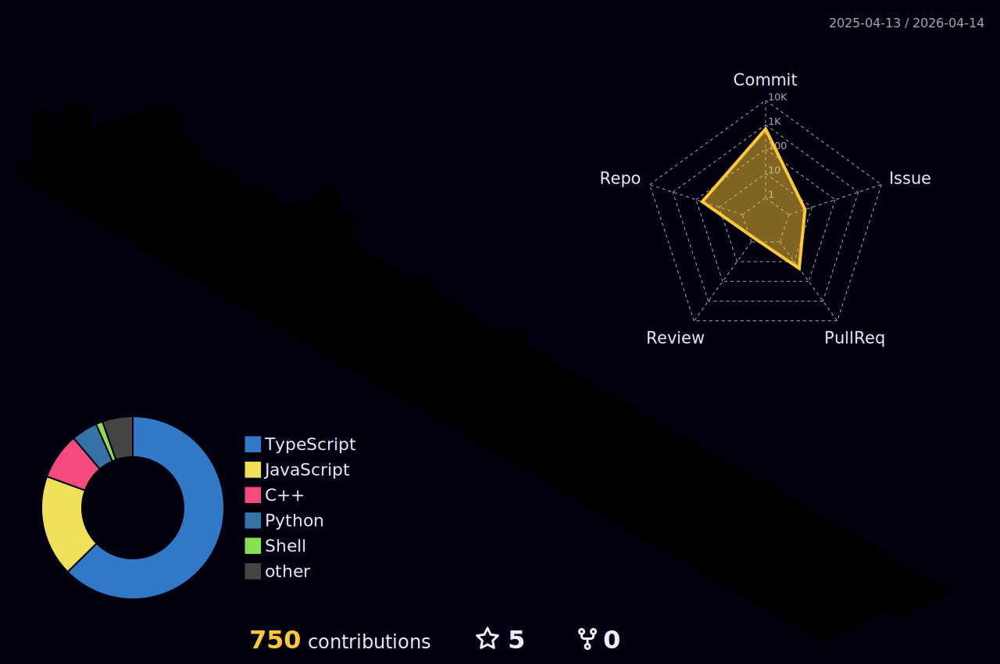

<!-- Banner -->
<p align="center">
  
</p>

---

### 👋 About Me

- 🧠 Backend Engineer | System Design Enthusiast  
- 🚀 Building scalable microservices & event-driven systems  
- 🛠 Currently working with **Kafka**, **PostgreSQL**, **Redis**, **Docker**, **CICD**, **AWS**, **GitHub Actions**, **Kubernetes**
- 📚 Learning Cloud Infrastructure, AWS, and Distributed Systems
- 🗂 I love organizing projects and writing clean, maintainable code  
- ✍️ Writing about tech & architecture (soon!)

---

### 🧰 Tech Stack

#### 🖥 Languages


#### 🌐 Frontend


#### 🧪 Backend


#### 🗃 Databases


#### 📩 Queues & Streams


#### 🛠 DevOps & Infra


#### 🧰 Tools


---

### 📈 GitHub Stats

<div align="center">
  
  <br /><br />
  
  <br /><br />
  
</div>

---

### 📝 Blog & Content (Coming Soon!)

<!-- Add links when available -->
- 🧾 Writing technical deep-dives on system architecture  
- 🗺️ Building a learning map for backend engineers  

---

### 📫 Let’s Connect

[](https://www.linkedin.com/in/mohit-soni-781b6b250/)
[](https://x.com/MohitSoni2002)

<!-- [](https://yourwebsite.com) -->

---

---

### ⚡ Fun Fact

```txt
I may look chill, but my Redis cache is always hot 🔥
```

---

---
## 🧠 Contributions Overview

<p align="center">
  
</p>

---
